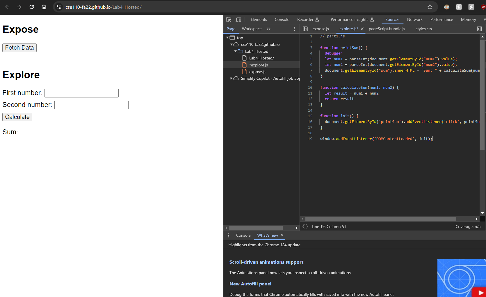

# DevTools - Debugging

1. What was the bug?  
   -  The bug is the fact that num1 and num2 are being treated as strings as supposed to numbers. The bug is that it just concatenates the two variables as strings, which isn't what we want.
     
2.  How would you fix it? Include a screenshot of your fix. Name it fix.png (or whatever image extension you would like to use) and add it to your expand/screenshots directory.  
   -  I would fix it by making sure that num1,num2, and result are treated as numbers. I'd potentially add a safeguard that ensures that num1 and num2 are inputted as numbers.
Screenshot in expand/screenshots/fix.png

